# 🖋️ Arabic Contract Generator

[](https://www.python.org/downloads/)
[](https://streamlit.io)
[](https://www.langchain.com/)
[](https://ai.google.dev/)

This web application provides a simple and efficient way to generate Arabic legal contracts. It uses a powerful **Retrieval-Augmented Generation (RAG)** architecture to combine your custom details with a knowledge base of existing legal templates, ensuring the final document is both accurate and relevant.

-----

## 🌟 Key Features

  - **📄 Dynamic Generation**: Creates contracts on-the-fly based on user inputs.
  - **📚 Template-Grounded**: Relies on a library of `.docx` legal templates to ensure quality and correctness.
  - **🤖 AI-Powered**: Uses Google's Gemini model for fluent and professional contract language.
  - **🖥️ Simple UI**: An intuitive web interface built with Streamlit makes it easy for anyone to use.
  - **📥 Downloadable**: Instantly download the generated contract as a text file.

-----

## ⚙️ How It Works: The RAG Pipeline

The application doesn't just ask an AI to write a contract from scratch. Instead, it uses a RAG pipeline, which is like giving the AI an "open-book exam." The AI can reference your trusted templates to generate the best possible output, reducing errors and "hallucinations."

Here is a visual overview of the workflow:

```mermaid
graph TD
    A[📄 DOCX Templates] -->|1. Load & Chunk| B(Text Chunks);
    B -->|2. Create Embeddings| C(Vector Database - FAISS);
    D[👤 User Inputs] -->|3. Formulate Query| E{Similarity Search};
    C --> E;
    E -->|4. Retrieve Relevant Context| F(Context Chunks);
    F -->|5. Augment Prompt| G[🤖 Gemini LLM];
    D -->|Also feeds into| G;
    G -->|6. Generate Final Contract| H[📜 Generated Contract];
```



**Step-by-Step Breakdown:**

1.  **Load & Chunk**: The relevant `.docx` contract templates are loaded and split into smaller, manageable chunks of text.
2.  **Embed & Store**: Each chunk is converted into a numerical vector (an "embedding") and stored in a FAISS vector database. This index captures the semantic meaning of the text.
3.  **Query & Retrieve**: When you fill out the form, your request is used to search the vector database for the most relevant chunks from the original templates.
4.  **Augment & Generate**: These retrieved chunks are combined with your specific details (names, dates, etc.) into a single, comprehensive prompt. This "augmented" prompt is then sent to the Gemini API, which generates the final, coherent contract.

-----

## 🛠️ Tech Stack

  - **Frontend**: [Streamlit](https://streamlit.io/)
  - **AI/LLM**: [Google Gemini Pro](https://ai.google.dev/)
  - **Orchestration**: [LangChain](https://www.langchain.com/)
  - **Embeddings**: [Hugging Face Sentence Transformers](https://huggingface.co/sentence-transformers)
  - **Vector Store**: [FAISS (Facebook AI Similarity Search)](https://engineering.fb.com/2017/03/29/data-infrastructure/faiss-a-library-for-efficient-similarity-search/)
  - **Document Loading**: `unstructured`, `python-docx`

-----

## 🏁 Getting Started

Follow these instructions to set up and run the project on your local machine.

### Prerequisites

  - Python 3.9+
  - Git for cloning the repository.

### Installation & Setup

**1. Clone the Repository**

```bash
git clone <your-repository-url>
cd <repository-folder>
```

**2. Create and Activate a Virtual Environment**
This keeps your project dependencies isolated.

```bash
# For macOS/Linux
python3 -m venv venv
source venv/bin/activate

# For Windows
python -m venv venv
.\venv\Scripts\activate
```

**3. Install Dependencies**

```bash
pip install -r requirements.txt
```

**4. Configure Your Gemini API Key**

> **⚠️ Security Warning:** Never hardcode your API keys directly in the code. Use environment variables for security.

Create a file named `.env` in the root of your project folder and add your API key to it:

```
# .env file
GEMINI_API_KEY="YOUR_API_KEY_HERE"
```

The application code needs to be updated to load this key. Make sure your Python script includes:

```python
# app.py
from dotenv import load_dotenv
import os

load_dotenv() # Loads variables from .env file
gemini_api_key = os.getenv("GEMINI_API_KEY")

# Also, add python-dotenv to your requirements.txt
# pip install python-dotenv
```

### Run the Application

Once the setup is complete, run the following command in your terminal:

```bash
streamlit run app.py
```

Your browser should automatically open to the application's URL (e.g., `http://localhost:8501`).

-----

## 📂 Project Structure

```
.
├── 📄 .env                  # Stores your API key (add this file)
├── 📜 app.py                 # The main Streamlit application script
├── 📋 requirements.txt       # List of Python dependencies
├── 📁 نماذج عقود/            # Directory for contract templates
│   └── 📄 عقد بيع شقة.docx
│   └── 📄 عقد إيجار.docx
│   └── ...
└── 🖼️ image_815a11.png      # UI screenshot for the README
```
